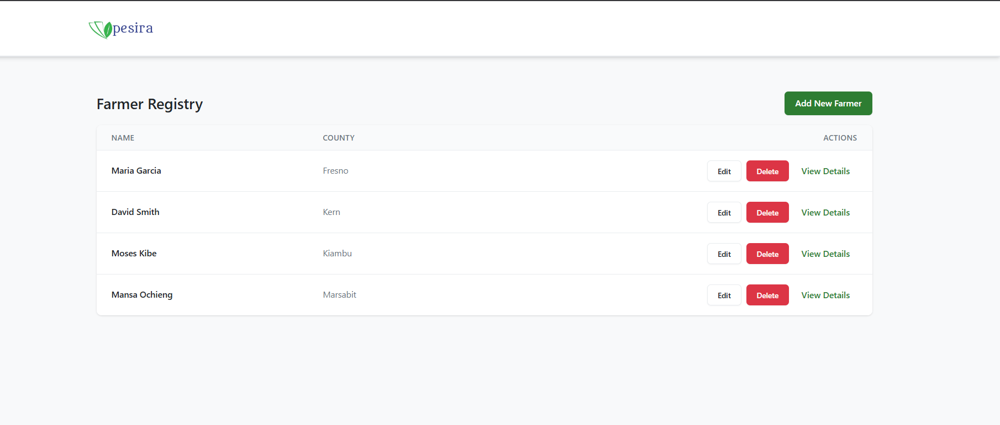
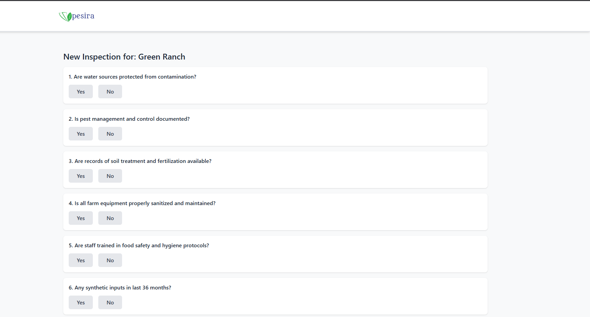
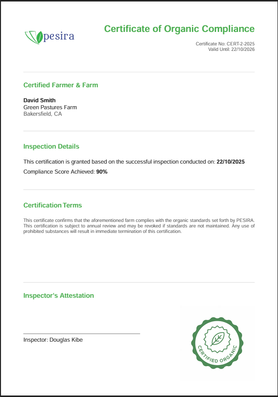

# Agri-Cert Management Portal

A full-stack web application designed to streamline the organic certification process for farms. This portal allows for the management of farmers, their farms, and field-level inspections, culminating in the automated generation of official PDF compliance certificates.

## Live Demo

The application is deployed and fully functional. You can access the live version here:

-   **Frontend (Vercel):** [https://agri-cert-app.vercel.app/](https://agri-cert-app.vercel.app/)
-   **Backend API (Render):** [https://agri-cert-backend.onrender.com/](https://agri-cert-backend.onrender.com/)

**Note:** The backend uses an in-memory database. Data will be reset if the free-tier service on Render hibernates due to inactivity.

---

## Key Features

-   **Full CRUD Operations:** A robust modal-based interface for creating, reading, updating, and deleting Farmers, Farms, and Fields.
-   **Guided Inspection Workflow:** A step-by-step checklist for conducting field inspections.
-   **Automated Compliance Scoring:** Inspection scores are calculated automatically based on checklist answers.
-   **Professional PDF Certificate Generation:** On approval (score >= 80%), a unique, branded PDF certificate is generated and made available for download.
-   **Modern, Responsive UI:** A clean, light-themed UI built with React and styled with TailwindCSS, featuring a tabbed interface for clarity.
-   **Robust Architecture:** A decoupled frontend/backend architecture with a centralized API client configured via environment variables for seamless local and production environments.

---

## Screenshots

### Main Farmer Registry


### Farmer Detail Page with Tabbed Interface


### Inspection Form


### Generated PDF Certificate


---

## Technical Stack

-   **Frontend:** React (Vite), React Router, TailwindCSS, Headless UI
-   **Backend:** Node.js, Express.js
-   **PDF Generation:** `pdfkit`
-   **Deployment:** Vercel (Frontend), Render (Backend)

---

## Bonus Deliverables

-   **UML Diagrams:** The architectural diagrams for the application are available in the `/docs` directory.
    -   [Class Diagram (Source)](./docs/class-diagram.puml)
    -   [Sequence Diagram (Source)](./docs/sequence-diagram.puml)

---

## Local Setup & Run

### Prerequisites
- Node.js (v18 or later recommended)
- npm

### 1. Clone the Repository
```bash
git clone https://github.com/<your-github-username>/agri-cert-app.git
cd agri-cert-app
2. Set Up the Backend Server
code
Bash
# Navigate to the server directory
cd server
# Install dependencies
npm install
3. Set Up the Frontend Client
code
Bash
# Navigate to the client directory from the project root
cd client
# Install dependencies
npm install
4. Create the Frontend Environment File
In the client directory, create a new file named .env and add the following line. This tells the frontend where to find the local backend API.
code
Code
VITE_API_BASE_URL=http://localhost:3001
5. Run the Application
You will need two separate terminals to run both servers concurrently.
Terminal 1 (Backend):
code
Bash
# From the /server directory
npm start
# Expected output: Server is running and listening on port 3001
Terminal 2 (Frontend):
code
Bash
# From the /client directory
npm run dev
# Expected output: VITE vX.X.X ready in XXX ms
The application will be accessible at http://localhost:5173 (or the port specified by Vite).

## Running Tests

Automated tests are included for both the backend and frontend.

-   **To run backend tests:**
    ```bash
    # From the /server directory
    npm test
    ```

-   **To run frontend tests:**
    ```bash
    # From the /client directory
    npm test
    ```